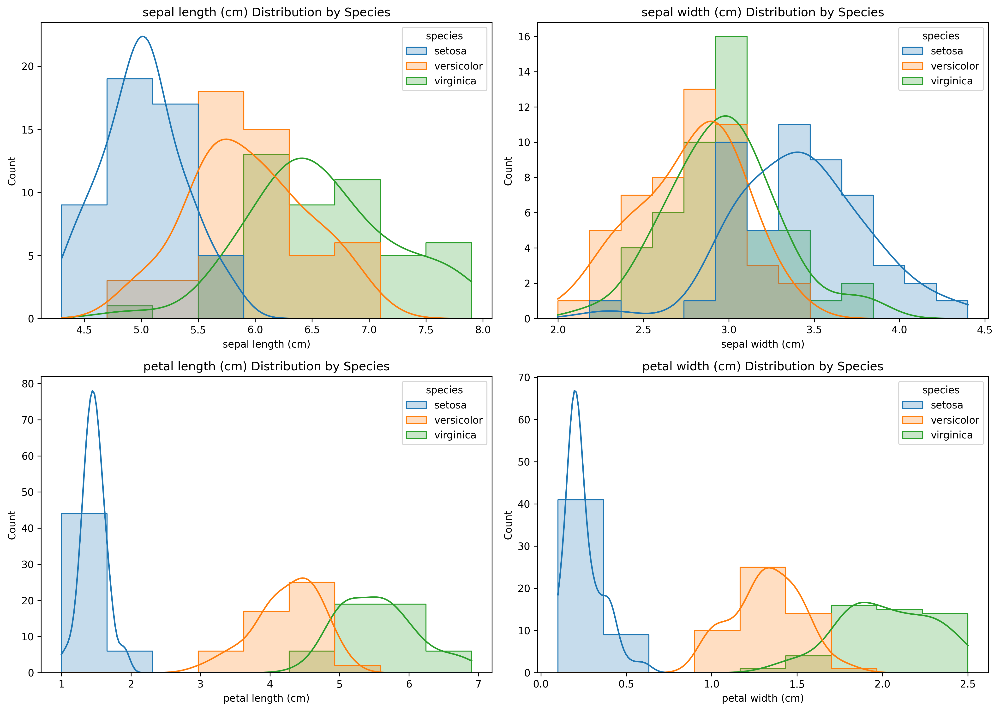
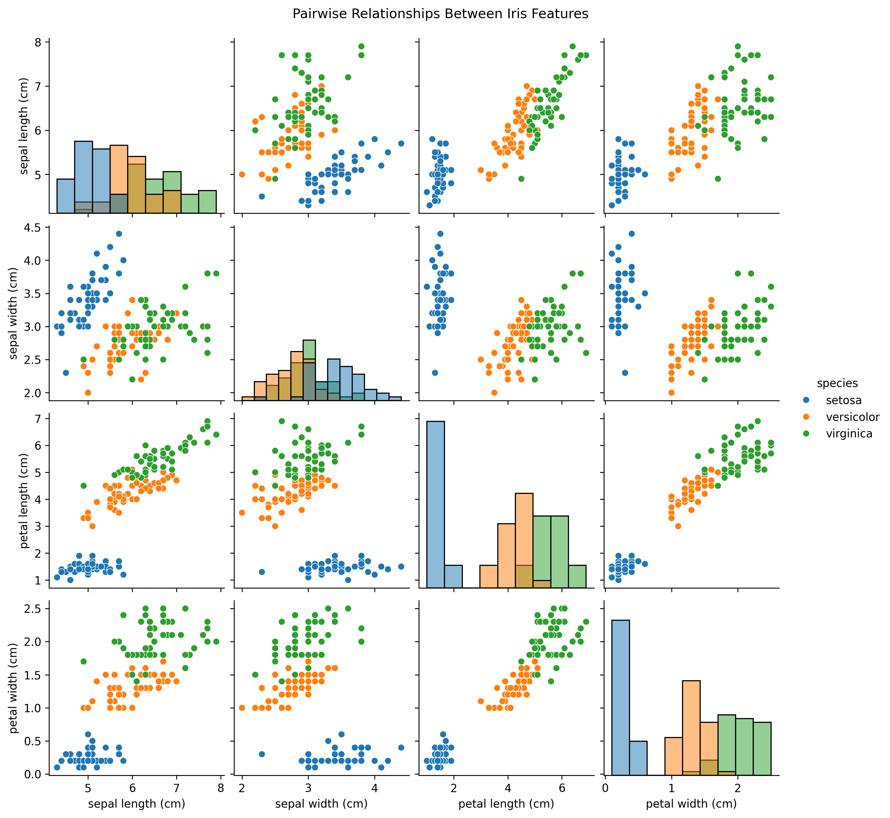
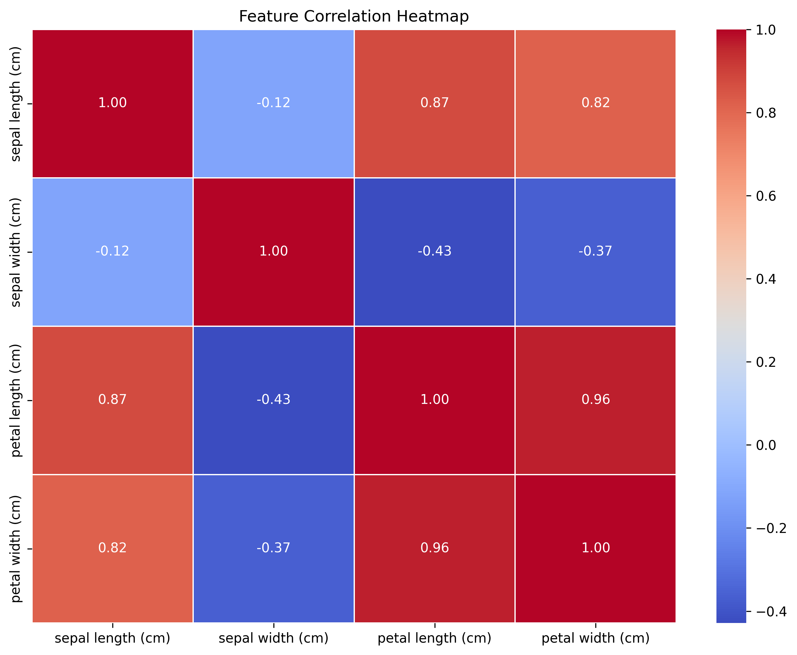
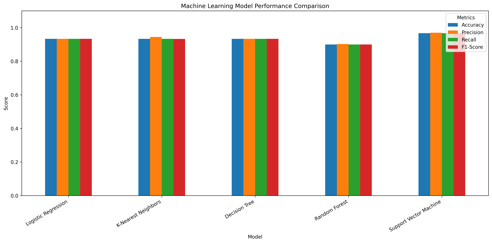
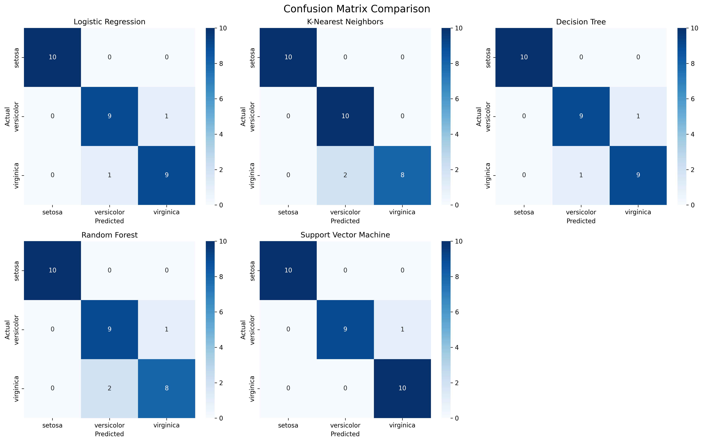
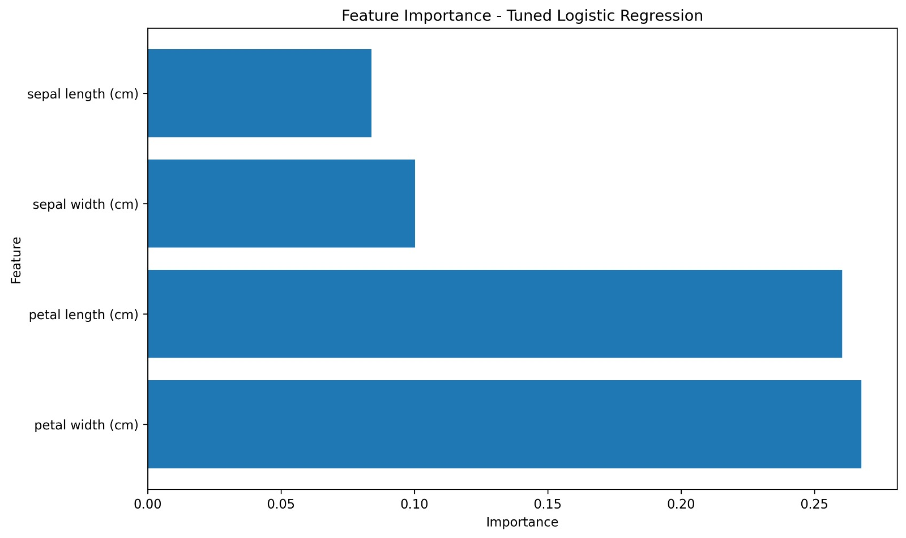

# 🌸 Iris Flower Classification

Machine Learning classification project that predicts the species of an Iris flower using its physical measurements.

## 🎯 Objective

Build a machine learning classification system to predict the species of an Iris flower based on its sepal and petal measurements.

## 🛠️ Technologies

- Python
- Pandas
- NumPy
- Matplotlib
- Seaborn
- Scikit-learn

## 🤖 Machine Learning Models

- Logistic Regression
- K-Nearest Neighbors
- Random Forest
- Support Vector Machine

## 🔍 Exploratory Data Analysis

The project includes:

- Feature distributions
- Pairplot
- Correlation heatmap
- Feature importance analysis

## 📊 Model Evaluation

Models are evaluated using:

- Accuracy
- Cross-validation
- Confusion matrix
- Model comparison

## 📈 Project Outputs

### Feature Distributions



### Pairplot



### Correlation Heatmap



### Model Comparison



### Confusion Matrix



### Feature Importance



## 📁 Project Files

- `Iris_Flower_Classification.ipynb` — Complete machine learning notebook
- `README.md` — Project documentation
- `requirements.txt` — Required Python libraries
- `iris_final_model.pkl` — Saved trained model
- `feature_distributions.png` — Feature distribution visualization
- `pairplot.png` — Pairwise feature visualization
- `correlation_heatmap.png` — Feature correlation visualization
- `model_comparison.png` — Model performance comparison
- `confusion_matrix.png` — Classification confusion matrix
- `feature_importance.png` — Feature importance visualization

## 🚀 How to Run

1. Clone or download this repository.
2. Install the required libraries:

```bash
pip install -r requirements.txt
